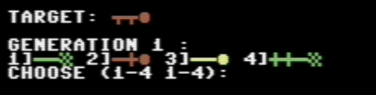

# INSTRUCTIONS

## HOW TO LOAD THE GAME

In order to play "Evolution 10" you need a COMMODORE 64 or an emulator of this computer, because the game does not work on modern computers. The game has been tried and it works correctly with *"VICE - the Versatile Commodore Emulator" ver. 3.5*. You can download it for free by [clicking here](http://vice-emu.sourceforge.net/).  

Once the emulator software has been installed, follow the instructions below:
 - start **x64sc.exe** program;
 - click on **File** > **Attach disk image** > **Drive 8**;
 - select <code>evolution10.d64</code> file ([click here to download](/blob/master/evolution10.d64));
 - click on **Attach**;
 - type <code>LOAD "EVOLUTION10",8,1</code>;
 - when finished loading, type <code>RUN</code>

## HOW TO PLAY

The game is turn-based. At the beginning of each round it is shown which individual (phenotype) is to be obtained from the genetic combination, and the available individuals are shown:

The player must indicate the pair of individuals that they want to "mix" to obtain two more. The player must choose two (different) numbers in the 1..4 interval. The player's choice should be such as to reward those individuals who individually, or combined, most closely resemble the target individual. The program therefore performs both genetic blending and phenotypic regeneration. **For a more extensive explanation we recommend to read [this article](https://retroprogramming.iwashere.eu/evolution10:genotype).**

The game repeats itself from generation to generation, until the player gets the wanted individual.

The greater the number of generations, the worse the result the player has achieved.